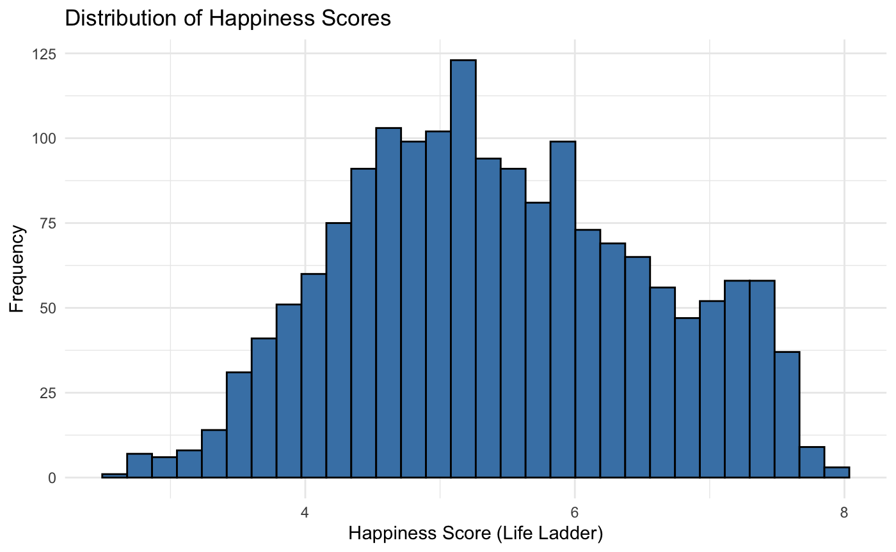
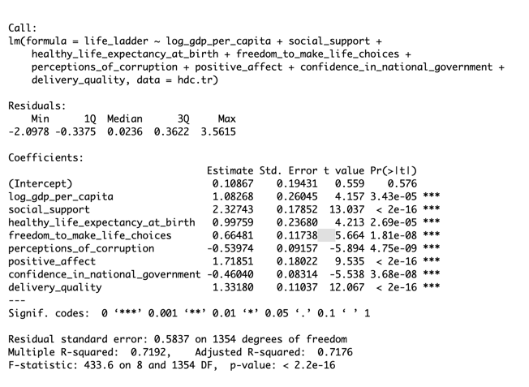

# 🌟 Happiness Prediction: A Data-Driven Approach

## 🔍 1. Exploratory Data Analysis

### **1.1 Data Loading & Initial Exploration**

**Dataset:** [World Happiness Report 2019](https://www.kaggle.com/datasets/PromptCloudHQ/world-happiness-report-2019)

The dataset comprises global happiness scores and various related factors for numerous countries in the year 2019. It includes key variables such as:

* **Life Ladder**: A subjective measure representing overall happiness.
* **Log GDP per Capita**: Economic output per person, adjusted logarithmically.
* **Social Support**: Availability of social support networks.
* **Healthy Life Expectancy at Birth**: Average expected years of good health.
* **Freedom to Make Life Choices**: Degree of autonomy and freedom.
* **Generosity**: Level of generosity within the society.
* **Perceptions of Corruption**: Extent to which corruption is perceived within the government.
* **Positive and Negative Affect**: Indicators measuring emotional experiences.

Initial exploration identified missing values and unnecessary columns, suggesting the need for thorough data cleaning.

### **1.2 Data Cleaning & Transformation**

* **Removed irrelevant columns:**

  * Retained only `life_ladder` as the target; removed redundant indices.
  * Removed columns with significant missing data (e.g., `GINI`, `most_people_can_be_trusted`).

* **Handled missing data:**

  * Filled numerical missing values using median imputation to maintain data integrity.

**Cleaned Dataset Overview:**

### **1.3 Data Visualization & Insights**

* **Happiness Score Distribution:** Normal distribution, average score \~5.4.

* **Geographical Patterns:** Higher scores in Northern Europe; lower in Africa.

* **Key Correlations:**

  * Strong positive correlation: GDP per capita, social support, healthcare.

---

## 📊 2. Statistical Analysis & Modelling

### **2.1 Linear Regression with Best Subset Selection**

* Optimal model selected based on BIC, Mallow’s Cp, Adjusted R² (8 predictors optimal).
* Model significance: explains 72% variance, no multicollinearity (all VIF < 5).

* **Residual Analysis:** No apparent patterns (well-distributed residuals).

### **2.2 Ridge Regression**

* Cross-validation identified optimal lambda.
* Coefficient highlights:

| Predictor                            | Coefficient |
| ------------------------------------ | ----------- |
| log\_gdp\_per\_capita                | 1.178       |
| social\_support                      | 2.298       |
| healthy\_life\_expectancy\_at\_birth | 1.001       |
| freedom\_to\_make\_life\_choices     | 0.627       |
| generosity                           | 0.237       |
| perceptions\_of\_corruption          | -0.590      |
| positive\_affect                     | 1.614       |
| negative\_affect                     | 0.244       |
| confidence\_in\_national\_government | -0.438      |
| democratic\_quality                  | 0.244       |
| delivery\_quality                    | 1.052       |

### **2.3 Random Forest**

* 5-fold CV hyperparameter tuning (`mtry = 5`) yielded lowest CV MSE: **0.1629**
* Test set MSE: **0.1555** (best-performing model)

### **2.4 K-Nearest Neighbors (KNN)**

* 5-fold CV hyperparameter tuning (`k = 3`) lowest CV MSE: **0.1881**
* Test set MSE: **0.1571**

---

## 📌 3. Model Performance Summary & Discussion

| Model             | Test MSE   |
| ----------------- | ---------- |
| **Random Forest** | **0.1555** |
| KNN               | 0.1571     |
| Linear Regression | 0.4489     |
| Ridge Regression  | 0.4564     |

* **Best Model:** Random Forest because it handles non-linear relationships and reduces overfitting.

* **KNN:** Good performance; will be more suitable for larger-sized, low-dimensional data.

* **Linear & Ridge Regression:** Poorer performance due to linear assumptions and sensitivity to outliers; limited capability in capturing complex non-linear patterns.

## 📈 4. Insights & Recommendations
Economic growth alone is insufficient to maximize happiness. Balanced investments in healthcare, social support, and freedom significantly contribute to overall well-being.

Governments and businesses should strategically focus on enhancing social infrastructure and reducing corruption to foster higher happiness levels.

Regions identified as lower in happiness present opportunities for targeted interventions and investments, especially in healthcare, mental well-being, and community support services.
