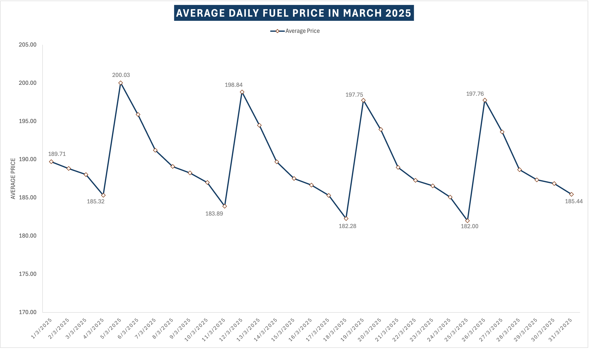

# 🚀 From Code to Insights
*A Software Engineer’s Journey in the World of Data*

Welcome! This is a portfolio showcasing my transition from **Software Engineer** to **Data Specialist**, with a collection of projects which demonstrate different aspects of the data analysis process.

---

## 👋 About Me

Hi, I’m **David** — a Software Engineer with a passion for data.
After several years building and maintaining scalable systems that collect millions of usage data daily,  I realised the true power of a business lies in the effective use of **data** to uncover insights and drive decision making.

This is the main reason why I’m pursuing a Master Degree of Predictive Analytics, with the focus on **Finance and Investment**. This course equips me with a deep understanding of financial market operations, investment strategies, economic and econometric modelling

🎯 Currently, I'm seeking internship opportunities in Data Science or Business Consulting roles to apply my skills and learn from real-world challenges.

---

## 🗂️ Selected Projects

### 1. 📈 Fuel Price Analysis Across Perth  
**Tools and skills:** Excel, Data Visualisation

**Summary:** Analysed daily fuel prices from multiple suburbs in Perth within a month. Used time-series analysis and geospatial mapping to detect pricing clusters and patterns.

**Approaches:**
- First, I scraped the [FuelWatch feed](https://www.fuelwatch.wa.gov.au) which includes information about Perth's service station. 
- Next, after looking at the summary of the dataset, I  make some related questions in order to get insights, for example, is there a weekly price cycle, or is there any geographical cluster across suburbs.
- Then, I use Excel's tools like Pivot table, calculation functions, and visualising data using different chart types (1-dimension and n-dimension chart) to find the answers to those questions
- Finally, I come up with some interesting insights as belows

**Key insights:**  

- There is a weekly fuel pricing cycle in Perth: It peaks every Wednesday and gradually declines throughout the week, reaching the lowest point on Tuesdays.  
- Fuel prices varied significantly across suburbs: The northernmost part formed a cluster of high average fuel prices, whereas the southernmost part generally showed lower average fuel prices.
- For each fuel type, certain brands offer lower prices than others, typically *FastFuel 24/7*, *Costco*, and *Burk*.
- Some fuel types show strong price correlations, making it possible to predict the price of one fuel type using the others with a high degree of accuracy. (e.g 98 RON, PULP, vs. ULP)  

➡️ [View Project](https://curtin-my.sharepoint.com/:x:/g/personal/22802495_student_curtin_edu_au/EScKRx-m-IZKv0GUF4VSYXkBBMaQaK63WZbWk8ccUXVmUQ?e=WPCciL)

---

### 2. 🏋️ Gym Member Churn Prediction  
**Tools:** scikit-learn, Matplotlib  
**Summary:** Developed classification models to predict gym member attrition using behavioral and demographic features. Evaluated models using precision, recall, and F1-score.  
➡️ [View Project](link-to-project-folder)

---

### 3. 🚌 Public Transport Usage Dashboard  
**Tools:** Power BI  
**Summary:** Created an interactive dashboard to visualize public transport usage by time, mode, and suburb. Built KPI cards and heatmaps for peak usage insights.  
➡️ [View Project](link-to-project-folder)

---

### 4. 💹 Market Sentiment from Financial News  
**Tools:** TextBlob, Python  
**Summary:** Collected and analyzed financial headlines to assign sentiment scores and visualize correlations with stock movements. Demonstrated ability to integrate text data into numerical insights.  
➡️ [View Project](link-to-project-folder)

---

## 📁 Repository Structure

